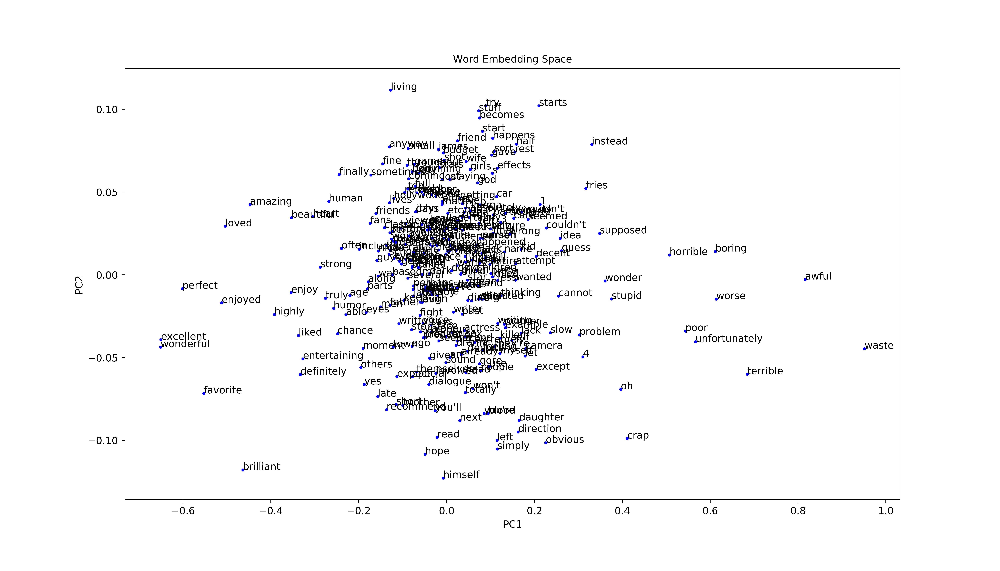

# FinTech Teaching Matarials
 **This Git Repo provide some simple implementations of Deep Learning models with Tensorflow, SCIPY, scikit learn, and Keras**
 
### **Requirments** 
- numpy >= 1.19
- pandas >= 1.0.1
- sckitlearn >= 0.22.0
- matplotlib >= 3.1.0
- pyreadr >= 0.4.0
- tensorflow == 2.5.0
- keres == 2.3.1

### **Running Deep Learning Models, e.g., MLP, CNN, on real world data. e.g., MNIST, CIFAR, IBDb, and stock market**
The iPython Notebook [Deep_Learning.ipynb](Deep_Learning.ipynb) provide a throguh implementation of several deep learning models. Most of the model is discussed in teh textbook **`An Introduction to Statistical Learning`** (G. James, D. Witten, T. Hastie, and R. Tibshirani).
The notebook is populated with enough comments to provide step-by-step instruction and explanation of all the models. 
 
##### **DATA**
The necessary data required for running the [Deep_Learning.ipynb](Deep_Learning.ipynb) is available in Folder  [data](data)

### **Sentiment Analysis with Deep Learning**
The iPython Notebook [Word_Embedding_with_Keres.ipynb](Word_Embedding_with_Keres.ipynb) proveide an implementation of word embedding for Sentiment Analysis with tensorflow and keras. 
The notebook is populated with enough comments to provide step-by-step instruction and explanation of all the models. 
The notebook use the IMDb movie rating data, which is available here or can directly be download the preprocesd data from `keres` with `keras.imdb.load_data` fucntion. 

##### Below is the learned embedding space represented in 2D for 300 most frequent words. 

